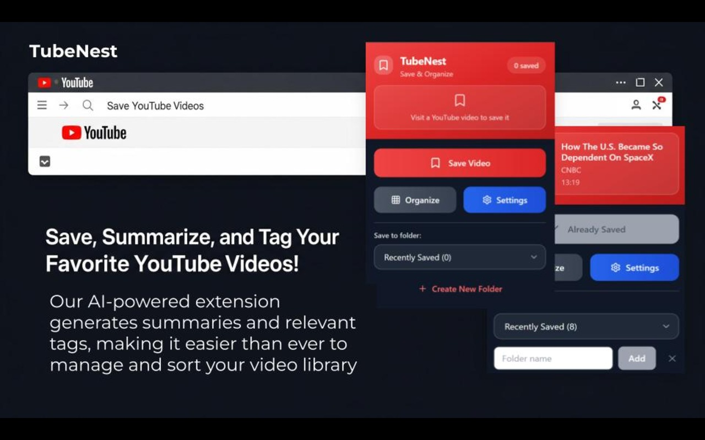

Click the link for more details [Click Here](https://chromewebstore.google.com/detail/tubenest/pkajmpfaahlhfolejpjfnobjnceaofmf) 
### CHROME EXTENSION FOR YOUTUBE - AUTOMATICALLY ORGANIZE YOUR VIDEOS

Save YouTube videos with one click and organize them intelligently

TubeNest is a powerful Chrome extension that helps you save and organize YouTube videos effortlessly.

Key Features:
• One-click video saving from any YouTube page
• Intelligent video organization with custom folders
• AI-powered video enrichment and tagging
• Export your video library to Excel
• Clean, intuitive interface
• Works seamlessly with YouTube

Perfect for researchers, content creators, students, and anyone who wants to build a personal video library. 

Instructions: Simply download the extension >> Add your API Key in settings >> Save Youtube Video and Enjoy :)
